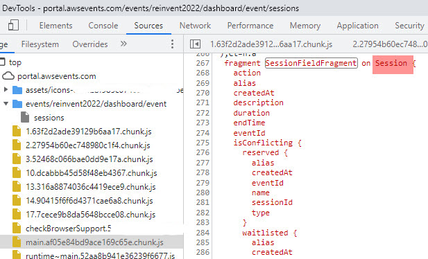

# AWS re:Invent Session Downloader (Updated for 2022!)

⚠️ *Use at your own risk! Not affiliated with Amazon Web Services, just a huge fan.*

## This repo contains code which provides 2 pieces of functionality

1. **Download re:Invent sessions to a text file** - Modified to pull for re:Invent 2022.  With over 1,400 sessions offered, it's difficult to use the session catalog and feel comfortable that you've seen everything you may want to attend. This script will allow you to download all of the re:Invent sessions from the catalog to a text file which you can then parse and manipulate in any way you wish. It also includes a column for whether you've starred the session or not.

## How to generate a list of sessions

1. Install the required Python packages listed in `requirements.txt`.
2. Copy the `config.example.py` file to `config.py` and update the values for `AWS_EVENTS_USERNAME` and `AWS_EVENTS_PASSWORD` to match your portal login.
3. Run the `reinvent_graphql.py` as it is.
4. Sessions will be downloaded and then saved to a file called `sessions.csv`.

## The file and inputs

`reinvent_graphql.py` - Grabs the list of sessions 100 at a time from the new GraphQL endpoint. Loops through each session and saves to a file.

## How this script works

With the launch of the re:Invent catalog for 2022, there are some exciting changes that make this process easier!  EventID for new re:Invent can be had here:


- Authentication to the AWS Events site (& therefore, the re:Invent Portal) are handled via AWS Cognito.
- The Session data is stored in a GraphQL database and accessible via a simple API call.
- The GraphQL data is protected by credentials provided when authenticating with Cognito, available via each user's specific login to the portal.
- Once the GraphQL token is retrieved from Cognito, the sessions list is pulled via a few simple API calls
- The `example_sessions_api_response.json` file contains example session data as it is returned from the API.
- Here is the schema for the sessions data passed down:
```javascript
fragment SessionFieldFragment on Session {
    action
    alias
    createdAt
    description
    duration
    endTime
    eventId
    isConflicting {
      reserved {
        alias
        createdAt
        eventId
        name
        sessionId
        type
      }
      waitlisted {
        alias
        createdAt
        eventId
        name
        sessionId
        type
      }
    }
    isEmbargoed
    isFavoritedByMe
    isPaidSession
    level
    location
    myReservationStatus
    name
    sessionId
    startTime
    status
    type
    capacities {
      reservableRemaining
      waitlistRemaining
    }
    customFieldDetails {
      name
      type
      visibility
      fieldId
      ... on CustomFieldValueFlag {
        enabled
      }
      ... on CustomFieldValueSingleSelect {
        value {
          fieldOptionId
          name
        }
      }
      ... on CustomFieldValueMultiSelect {
        values {
          fieldOptionId
          name
        }
      }
      ... on CustomFieldValueHyperlink {
        text
        url
      }
    }
    package {
      itemId
    }
    price {
      currency
      value
    }
    venue {
      name
    }
    room {
      name
    }
    sessionType {
      name
    }
    speakers {
      speakerId
      jobTitle
      companyName
      user {
        firstName
        lastName
      }
    }
    tracks {
      name
    }
  }
```
  More detail on available schemas and queries can be had by reviewing at your leiser this file:
  
